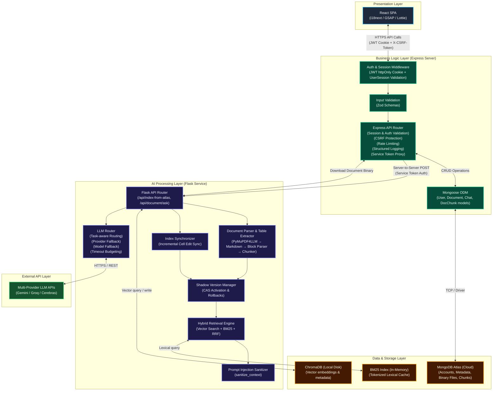
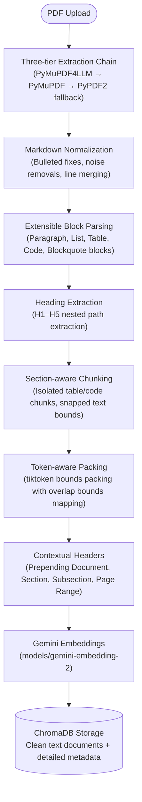

# SmartDocQ — AI Document Assistant

**Live Demo:** [https://smartdocq.vercel.app](https://smartdocq.vercel.app)

SmartDocQ is a full-stack document intelligence platform for uploading, indexing, searching, editing, and querying documents. It combines semantic vector retrieval, BM25 lexical search, and Reciprocal Rank Fusion (RRF), with a task-aware LLM routing layer for generation and provider fallback.

## Features

### Core AI Features
- **AI-Powered Chat**: Hybrid RAG-based question answering using Vector Search + BM25 + RRF Fusion.
- **Interactive Spreadsheet Editing**: Edit CSV and Excel (XLSX) documents directly in the browser. SmartDocQ incrementally synchronizes affected table and paragraph chunks without rebuilding the entire document index.
- **Quiz Generation**: Automatic creation of multiple-choice, true/false, and short-answer questions from document content.
- **Flashcard Creation**: Smart extraction of key concepts and definitions for effective learning and revision.
- **Text Summarization**: Concise summaries of document content for quick comprehension.

### Indexing & Retrieval
- **Contextual document embeddings**: Prepend document title, hierarchical headings, and page ranges before embedding, improving retrieval quality while preserving the original chunk text for generation.
- **Multi-Format Support**: Upload and process PDF, DOCX, TXT, CSV, and XLSX files.
- **Token-Aware Chunking**: Heading-aware section tracing and token bounds packing with tiktoken.
- **Hybrid Retrieval**: Dense vector search + version-isolated BM25 lexical search combined with Reciprocal Rank Fusion (RRF, $k=60$).
- **Spreadsheet-Aware Indexing**: Cell-level incremental sync updates affected semantic vectors and lexical indexes without full re-indexing.
- **Atomic Shadow Indexing**: Versioned builds with compare-and-swap (CAS) activation and automated rollback.
- **Index-State Bloom Filter**: Process-local Counting Bloom filter for non-authoritative fast negative rejection.

### Security
- **HTTP-only Cookie Authentication**: JWT session tokens are stored in HTTP-only cookies and validated against server-side session state, with role-based access control.
- **CSRF Protection**: State-changing requests use CSRF protection with Origin/Referer validation.
- **Server-Side Input Validation**: API inputs are validated before business logic or database access.
- **Authentication & Rate Limiting**: Authentication and sensitive endpoints use dedicated rate limits and authorization controls.
- **Internal AI Service Authentication**: Browser clients cannot directly access Flask; protected AI routes require a shared `SERVICE_TOKEN`.
- **Sensitive-Data Detection & Consent**: Detects sensitive information such as Aadhaar, PAN, credit cards, emails, and phone numbers and requires consent before processing.
- **Prompt Injection & Context Sanitization**: User questions are checked against injection/jailbreak heuristics, while retrieved document content is treated as untrusted input and sanitized before LLM processing.
- **Document Hashing & Deduplication**: SHA-256 document fingerprints prevent unnecessary duplicate processing.

> Detailed security architecture, implementation, threat considerations, and testing are documented in [`SECURITY.md`](SECURITY.md).

### Administration
- **User Management**: Comprehensive admin dashboard for user oversight and role assignment.
- **Document Analytics**: Track document uploads, processing status, and usage statistics.
- **Report Management**: Handle user feedback and support inquiries efficiently.
- **System Monitoring**: Structured logging of HTTP requests and security events (Pino), Prometheus metrics counters, health checks, and background watchdog maintenance jobs.

---

## System Architecture



---

## Technology Stack

### Frontend
- **React 19**: SPA component architecture with React Router 7, i18next, GSAP, Lottie, and Focus Trap React.

### Backend (Node.js)
- **Node.js & Express 5**: API server, Mongoose 8 ODM, Pino logging, Helmet security, compression, and express-rate-limit.
- **Authentication**: JWT stored in an `httpOnly` cookie verified against server-side session state (`UserSession`).

### AI & Retrieval (Python / Flask)
- **Flask 3**: Microservice for document processing, RAG pipelines, and LLM routing.
- **LLM Router**: Task-aware provider routing with provider and model fallback.
- **Vector & Lexical Retrieval**: ChromaDB (`gemini-embedding-2`), in-memory BM25 lexical search, and Reciprocal Rank Fusion (RRF, $k=60$).

### Document Processing
- **PyMuPDF4LLM & PyMuPDF (fitz)**: Layout-aware structural Markdown extraction.
- **PyPDF2**: Backup plain-text PDF parser.
- **python-docx & openpyxl**: Microsoft Word and Excel spreadsheet parsing.
- **tiktoken**: BPE token packing and section chunking bounds.

### Primary Storage
- **MongoDB Atlas**: User accounts, document metadata, file chunks, and server session state.
- **ChromaDB**: Local persistent vector database for document embeddings.

---

## PDF Indexing Pipeline

SmartDocQ processes PDF documents through a multi-stage indexing pipeline:



---

## Index Lifecycle Management

SmartDocQ uses versioned shadow indexes to safely evolve embeddings and indexing logic without interrupting retrieval.

Each generation tracks the embedding model, pipeline version, chunking version, source file hash, and indexing timestamp. New generations are built independently and activated using compare-and-swap (CAS). Failed builds leave the active generation unchanged, while stale indexing jobs are recovered in the background.

---

## Retrieval Architecture

Retrieval is always performed against the currently active index generation, ensuring background reindexing never interrupts user queries.

SmartDocQ uses a Hybrid RAG pipeline that combines:
- **Semantic vector retrieval** (ChromaDB + gemini-embedding-2)
- **Version-isolated BM25 lexical retrieval** with in-memory caching
- **Reciprocal Rank Fusion (RRF)**
- **Table-aware ranking**
- **Contextual document embeddings** (Document, Section, Subsection, Page Ranges)

This approach improves both semantic understanding and exact-match retrieval for identifiers, spreadsheet data, and structured documents.

### Benchmarking

SmartDocQ includes separate empirical benchmark suites for retrieval quality, index decision path performance, and PDF extraction:

#### Retrieval Benchmark (BEIR SciFact Corpus, 300 Queries)
- **Hybrid Dense + BM25 + RRF (Baseline)**: nDCG@5 = **0.8294**, MRR@5 = **0.8092**, Recall@5 = **0.9146**, Retrieval Latency = **149.09 ms**.
- **RRF + BGE Reranker (`BAAI/bge-reranker-base`)**: nDCG@5 = **0.7337** (-11.53%), MRR@5 = **0.7107** (-12.18%), Recall@5 = **0.8331** (-8.91%), Retrieval Latency = **15,373.12 ms** (+15.24s cross-encoder latency).
- **Candidate Pool Recall**: **0.9867** (relevant documents were already captured in top RRF candidates prior to reranking).
- **Decision**: Cross-encoder reranking decreased retrieval metrics while adding substantial latency; baseline Hybrid RRF is enabled by default.

#### Index-State Bloom Filter Benchmark (1,000 Absent IDs, 100 Indexed Documents)
- **Observed Sample False-Positive Rate**: **0.00%** (0/1,000 false positives; exact 95% upper confidence bound `< 0.30%`).
- **Rejection Latency**: **0.0052 ms** (Bloom ON) vs **0.9613 ms** (Bloom OFF) median lookup latency for absent documents.
- **P95 Tail Latency**: Up to **10.42x speedup** on negative lookups.

Detailed benchmark methodology, configurations, and reports:
- [Information Retrieval & Reranker Report](backend/benchmark/retrieval_benchmark.md)
- [Index Bloom Filter Benchmark Report](backend/benchmark/bloom_benchmark.md)
- [PDF Extractor Benchmark Overview](docs/benchmark/PDF-Extractor-Benchmark.md)

---

## Requirements

To set up SmartDocQ locally, you'll need:
- **Node.js**: Version 20.x or higher
- **Python**: Version 3.9 or higher
- **MongoDB**: Local installation or MongoDB Atlas account
- **AI Provider API Keys**: Gemini, Groq, and Cerebras API credentials for LLM generation
- **Git**: Version control

---

## Local Setup Instructions

### 1. Clone Repository
```bash
git clone https://github.com/SmartDocQ/SmartDocQ.git
cd SmartDocQ
```

### 2. Backend Middleware Setup (Node API)
```bash
cd servers
npm install

# Create .env file with the following variables:
# PORT=5000
# MONGO_URI=your_mongodb_connection_string
# JWT_SECRET=your_jwt_secret_key
# FRONTEND_ORIGINS=http://localhost:3000
# DNS_SERVERS=1.1.1.1,8.8.8.8
# SERVICE_TOKEN=shared_strong_secret
# FLASK_ASK_URL=http://localhost:5001/api/document/ask
# FLASK_INDEX_URL=http://localhost:5001/api/index-from-atlas
# FLASK_CONVERT_URL=http://localhost:5001/api/convert/word-to-pdf
# MAX_UPLOAD_SIZE_MB=15
# MAIL_USER=your_gmail_address (required in development only)
# MAIL_PASS=your_gmail_app_password (required in development only)
# BREVO_API_KEY=your_brevo_api_key (required in production only)
# BREVO_SENDER_EMAIL=your_brevo_sender_email (required in production only)
# BREVO_SENDER_NAME=your_brevo_sender_name (optional in production only)

npm start
```

### 3. AI Service Setup (Flask)

React communicates only with Node.js. The Flask service is intended for internal server-to-server communication and should not be called directly by browser clients.

```bash
cd ../backend
python -m venv venv
source venv/bin/activate  # On Windows: venv\Scripts\activate
pip install -r requirements.txt

# Create .env file with:
# PORT=5001
# FRONTEND_ORIGINS=http://localhost:3000
# NODE_BASE_URL=http://localhost:5000
# SERVICE_TOKEN=shared_strong_secret (must be identical to the SERVICE_TOKEN in servers/.env)
# GEMINI_API_KEY=your_google_ai_api_key
# GROQ_API_KEY=your_groq_api_key
# CEREBRAS_API_KEY=your_cerebras_api_key
# INDEX_BATCH_SIZE=64
# MAX_UPLOAD_SIZE_MB=15

# Optional chunking configurations:
# CHUNK_TARGET_TOKENS=512
# CHUNK_SOFT_LIMIT=600
# CHUNK_HARD_LIMIT=800
# CHUNK_OVERLAP_TOKENS=80
# IGNORE_REFERENCE_SECTIONS=True

python main.py
```

### 4. Frontend Setup (React)
```bash
cd ../my-app
npm install

# Create .env file with:
# REACT_APP_API_URL=http://localhost:5000
# REACT_APP_GOOGLE_CLIENT_ID=your_google_oauth_client_id

npm start
```

---

## Running Tests

Run the Python test suite (Flask AI service):
```bash
cd backend
# Set SERVICE_TOKEN (PowerShell: $env:SERVICE_TOKEN="dev-token")
python -m pytest tests/ -v
```

---

## Observability & Monitoring

SmartDocQ includes built-in latency instrumentation for every retrieval request.

Captured metrics include:
- embedding latency
- Chroma retrieval latency
- BM25 latency
- RRF fusion latency
- LLM latency
- LLM provider/model selection
- fallback activation and fallback reason
- total request latency

Additional backend metrics include:
- HTTP request latency histograms
- Node.js process metrics
- Session auto-upgrade counter
- CSRF refresh counter

Internal timings are logged server-side while remaining hidden from client responses.

---

## Contributors

Thanks to all the contributors who have helped build SmartDocQ:

<!-- ALL-CONTRIBUTORS-LIST:START -->
<table>
	<tr>
		<td align="center">
			<a href="https://github.com/Dr-Venom29">
				
				<br />
				<sub><b>Dr-Venom29</b></sub>
			</a>
		</td>
		<td align="center">
			<a href="https://github.com/ANIRUDH-7600">
				
				<br />
				<sub><b>ANIRUDH-7600</b></sub>
			</a>
		</td>
		<td align="center">
			<a href="https://github.com/sameekhsa">
				
				<br />
				<sub><b>sameekhsa</b></sub>
			</a>
		</td>
		<td align="center">
			<a href="https://github.com/ananya-1507">
				
				<br />
				<sub><b>ananya-1507</b></sub>
			</a>
		</td>
		<td align="center">
			<a href="https://github.com/srithi-05">
				
				<br />
				<sub><b>srithi-05</b></sub>
			</a>
		</td>
	</tr>
</table>
<!-- ALL-CONTRIBUTORS-LIST:END -->
