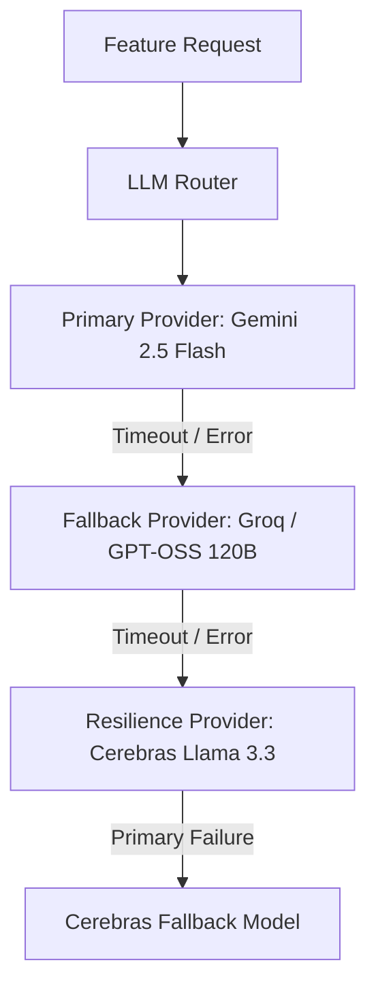
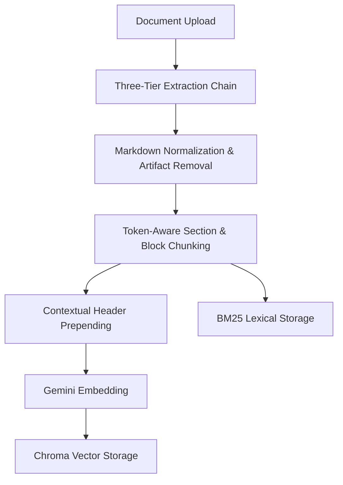
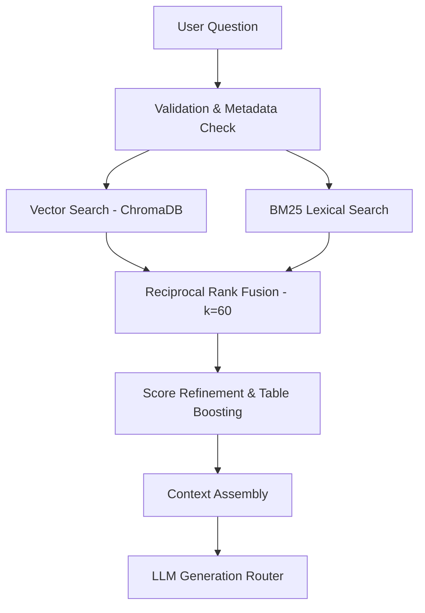
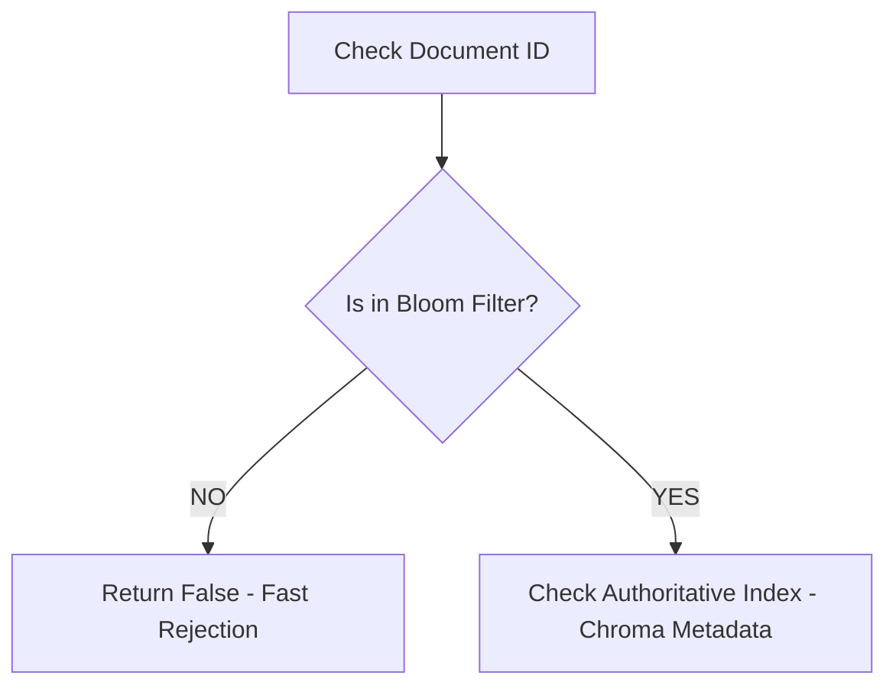

# SmartDoc AI Service (Python / Flask Backend)

This service provides document extraction, token-aware chunking, hybrid vector/lexical indexing, context retrieval, LLM task routing, and document intelligence features for SmartDocQ.

---

## Environment Variables

### Required
- `SERVICE_TOKEN` — Shared secret used to authenticate server-to-server HTTP requests from the Node.js backend.
- `NODE_BASE_URL` — Base URL of the Node.js API for document downloads, metadata access, and callbacks (default: `http://localhost:5000`).
- `GEMINI_API_KEY` — Google Generative AI API key.
- `GROQ_API_KEY` — Groq API key.
- `CEREBRAS_API_KEY` — Cerebras API key.

### Models
- `TEXT_MODEL` — Gemini text generation model (default: `models/gemini-2.5-flash`).
- `EMBED_MODEL` — Gemini embedding model (default: `models/gemini-embedding-2`).
- `GROQ_MODEL` — Groq primary model identifier (configured constant: `openai/gpt-oss-120b`).
- `CEREBRAS_PRIMARY_MODEL` — Cerebras primary model identifier (configured constant: `llama-3.3-70b`).
- `CEREBRAS_FALLBACK_MODEL` — Cerebras fallback model identifier (configured constant: `llama3.1-8b`).
- `RERANKER_MODEL` — Experimental cross-encoder reranker model (default: `BAAI/bge-reranker-base`).

### Network & Request Limits
- `PORT` — Port for the Flask AI service (default: `5001`).
- `FRONTEND_ORIGINS` — Comma-separated CORS allowlist (default: `http://localhost:3000`).
- `MAX_UPLOAD_SIZE_MB` — Maximum document upload size limit in MB (default: `15`).
- `NODE_FETCH_TIMEOUT` — Timeout for HTTP requests to Node.js backend in seconds (default: `45`).

### LLM Timeouts
- `LLM_PRIMARY_TIMEOUT` — Timeout per primary provider attempt in seconds (default: `10`).
- `LLM_FALLBACK_TIMEOUT` — Timeout per fallback provider attempt in seconds (default: `10`).
- `LLM_TOTAL_TIMEOUT` — Shared global wall-clock deadline across all LLM attempts in seconds (default: `15`).

### Retrieval & Indexing
- `INDEX_BATCH_SIZE` — Batch size for Chroma chunk upserts (default: `64`).
- `CHROMA_DB_PATH` — Directory path for persistent Chroma vector storage (default: `chroma_db`).
- `BM25_CACHE_TTL` — Cache TTL in seconds for in-memory BM25 index instances (default: `10800` / 3 hours).
- `ENABLE_INDEX_BLOOM` — Feature flag to enable the process-local Counting Bloom filter (default: `false`).

### Security & Debug
- `JAILBREAK_THRESHOLD` — Weighted risk score threshold for prompt safety validation (default: `3`).
- `FLASK_DEBUG` — Flask debug mode flag (default: `false`).

---

## Installation & Execution

Create and activate a virtual environment, then install dependencies:

```bash
pip install -r requirements.txt
```

Start the AI service:

```bash
python main.py
```

The service runs on port `5001` by default.

---

## Backend Structure

- `routes/` — HTTP route handlers.
- `features/` — Quiz, flashcard, summarization, and table-edit services.
- `services/` — Retrieval, BM25, embeddings, LLM routing, versioning, and document registry.
- `indexing/` — Extraction, chunking, embedding preparation, and indexing pipeline.
- `db/` — ChromaDB adapter.
- `utils/` — PDF layout extraction, security, formatting, and table utilities.
- `tests/` — Automated unit and integration test suite.
- `benchmark/` — Retrieval and performance benchmarking scripts and reports.

---

## Dependencies

- **PyMuPDF4LLM / PyMuPDF (fitz)**: Multi-format PDF layout parser converting PDF text and tables to Markdown.
- **PyPDF2**: Fallback PDF text parser.
- **tiktoken**: Byte Pair Encoding (BPE) tokenizer used for token-aware chunk bounds.
- **rank-bm25**: Lexical BM25 indexing and querying with version-isolated caching.
- **ChromaDB**: Vector storage for document embeddings and metadata.
- **groq**: Groq Cloud Python SDK.
- **cerebras-cloud-sdk**: Cerebras Cloud Python SDK.
- **google-generativeai**: Google Gemini SDK.

---

## Service Authentication & Health Check

### Health Endpoints (Public)
- `GET /healthz` → `{ "status": "ok" }`
- `GET /` → `{ "service": "SmartDocQ Flask", "status": "ok" }`

### Service Authentication
Protected Flask routes require the `x-service-token` HTTP header.
- `/healthz` and `/` are public endpoints.
- Other routes are denied unless the provided header matches `SERVICE_TOKEN`.
- Token comparison uses constant-time `hmac.compare_digest` to prevent timing side-channel attacks.
- `x-user-id` may be forwarded by the Node service for request logging and audit tracking.

---

## LLM Routing

Feature services do not call provider SDKs directly. They request generation through the centralized LLM Router using logical tasks such as `qa`, `general_qa`, `summarization`, `quiz`, `flashcards`, and `conversation`.



### Task Routing Policy

| Task | Provider Fallback Chain |
| :--- | :--- |
| `qa` | Gemini 2.5 Flash → Groq GPT-OSS 120B → Cerebras Llama 3.3 |
| `general_qa` | Groq GPT-OSS 120B → Gemini 2.5 Flash → Cerebras Llama 3.3 |
| `summarization` | Gemini 2.5 Flash → Groq GPT-OSS 120B → Cerebras Llama 3.3 |
| `quiz` | Groq GPT-OSS 120B → Gemini 2.5 Flash → Cerebras Llama 3.3 |
| `flashcards` | Groq GPT-OSS 120B → Gemini 2.5 Flash → Cerebras Llama 3.3 |
| `conversation` | Groq GPT-OSS 120B → Gemini 2.5 Flash → Cerebras Llama 3.3 |

The router manages:
- Task-specific provider ordering.
- Retryable error classification (429 Rate Limit, 5xx Server Error, network timeouts).
- Provider fallback (e.g., Gemini → Groq → Cerebras).
- Cerebras model-level fallback (primary model → fallback model).
- Normalized generation responses with fallback observability metadata.

### LLM Latency Budget

The router uses a shared 15-second wall-clock deadline:
- **Primary attempt**: up to 10 seconds
- **Fallback attempt**: up to 10 seconds
- **Total routing budget**: 15 seconds

Fallback attempts receive only the remaining time within the global deadline.

---

## PDF Extraction Chain

PDF extraction uses a three-tier fallback chain:

1. **PyMuPDF4LLM** (Default) — Converts pages and tables into structured Markdown.
2. **PyMuPDF Classic** (Fallback 1) — Plain text extraction if layout parsing fails.
3. **PyPDF2** (Fallback 2) — Backup text extraction if Fitz modules fail to load.

---

## Indexing & Retrieval Architecture

SmartDocQ processes uploads into token-aware Markdown chunks indexed into ChromaDB and BM25.



### Indexing Features

- Markdown normalization and page-artifact removal.
- Heading-aware section extraction.
- Token-aware chunk sizing with tiktoken.
- Dedicated table, code, HTML, and equation chunks.
- Structural metadata (document ID, section path, page range, hashes, versioning).
- Dual-representation spreadsheet indexing (table chunks + narrative summaries).

### Contextual Chunk Headers

Before vector generation, a structural context block is prepended to the text sent to `gemini-embedding-2`:
```text
Document: [filename]
Section: [H1 Section Title]
Subsection: [H2 > H3 Subsection Path]
Pages: [Page / Page Range]
```
ChromaDB stores the clean chunk text without prepended headers to prevent polluting lexical BM25 search matching.

### Hybrid Retrieval & BGE Reranker Evaluation



The retrieval pipeline combines dense vector search in ChromaDB with lexical BM25 search using Reciprocal Rank Fusion (RRF, $k=60$).

The BEIR SciFact benchmark showed that the evaluated BGE cross-encoder reranker (`BAAI/bge-reranker-base`) reduced nDCG@5, MRR@5, and Recall@5 while substantially increasing retrieval latency. Reranking is therefore disabled by default.

### Index-State Bloom Filter

SmartDocQ uses a process-local Counting Bloom filter to reject document IDs that are definitely not indexed without performing an authoritative index-state lookup.



- **Bloom-negative**: Returns `False` immediately (fast non-authoritative rejection).
- **Bloom-positive**: Triggers the authoritative index-state check (Bloom positives never authorize document existence).
- Maintains exact set membership tracking (`_members: Set[str]`) for idempotent updates and safe decrements on deletion.
- Rebuilt from persistent Chroma metadata at startup when enabled (`ENABLE_INDEX_BLOOM`).
- Bypassed when disabled (`ENABLE_INDEX_BLOOM = False` by default in development) or if uninitialized.

The benchmark is documented separately in the [benchmark directory](benchmark/README.md).

---

## Incremental Table Cell Editing

Spreadsheet edits (CSV/XLSX) update affected table and paragraph chunks without rebuilding the entire document index.

- **Hash-based embedding reuse**: Computes SHA-256 block signatures to avoid re-embedding unchanged table chunks.
- **Cross-store synchronization**: Updates ChromaDB, BM25, and MongoDB in a defined order. The workflow does not use a distributed transaction.
- **Audit logging**: Records cell-level modification entries (`EditHistory` schema).

---

## Version Validation & Shadow Reindexing

Stored chunks include:
- `embedding_model`
- `pipeline_version`
- `chunking_version`
- `file_hash`
- `indexed_at`

Configuration or source changes trigger reindexing.

New vector/BM25 generations are built separately from the active generation. A successful compare-and-swap (CAS) activation promotes the new generation; failed builds leave the active generation unchanged.

Legacy chunks without current version metadata can be migrated through the background reindexing workflow.

A watchdog detects stale `queued` or `indexing` jobs and recovers them using optimistic version checks.

---

## Testing

Note: `SERVICE_TOKEN` is required to import route modules; set a dummy value in your shell for unit testing.

Run the test suite:

```bash
python -m pytest tests
```

Specific test modules:

```bash
# LLM Router tests
python -m pytest tests/test_llm_router.py -v

# Indexing & chunking tests
python -m pytest tests/test_chunking.py -v
python -m pytest tests/test_indexer.py -v

# Retrieval & Bloom filter tests
python -m pytest tests/test_retrieval_service.py -v
python -m pytest tests/test_document_index_registry.py -v

# Feature tests (quiz, flashcards, summarization, table edit)
python -m pytest tests/test_quiz_generator.py -v
python -m pytest tests/test_flashcard_generator.py -v
python -m pytest tests/test_summarizer.py -v
python -m pytest tests/test_table_edit.py -v

# Security & Vector versioning tests
python -m pytest tests/test_security.py -v
python -m pytest tests/test_vector_versioning.py -v
```

---

## Benchmarks

The backend contains separate benchmarks for:

- **PDF extraction** — compares extraction libraries using extraction time, resource usage, page coverage, and structural output.
- **Information retrieval** — compares Hybrid Dense + BM25 + RRF against the experimental BGE reranker on BEIR SciFact.
- **Index-state Bloom filter** — measures the process-local Counting Bloom filter's lookup latency, workload break-even behavior, and observed false-positive rate.

Detailed benchmark reports:
- [Information Retrieval Report](benchmark/retrieval_benchmark.md)
- [Index Bloom Filter Report](benchmark/bloom_benchmark.md)
- [Benchmarking Module Overview](benchmark/README.md)
