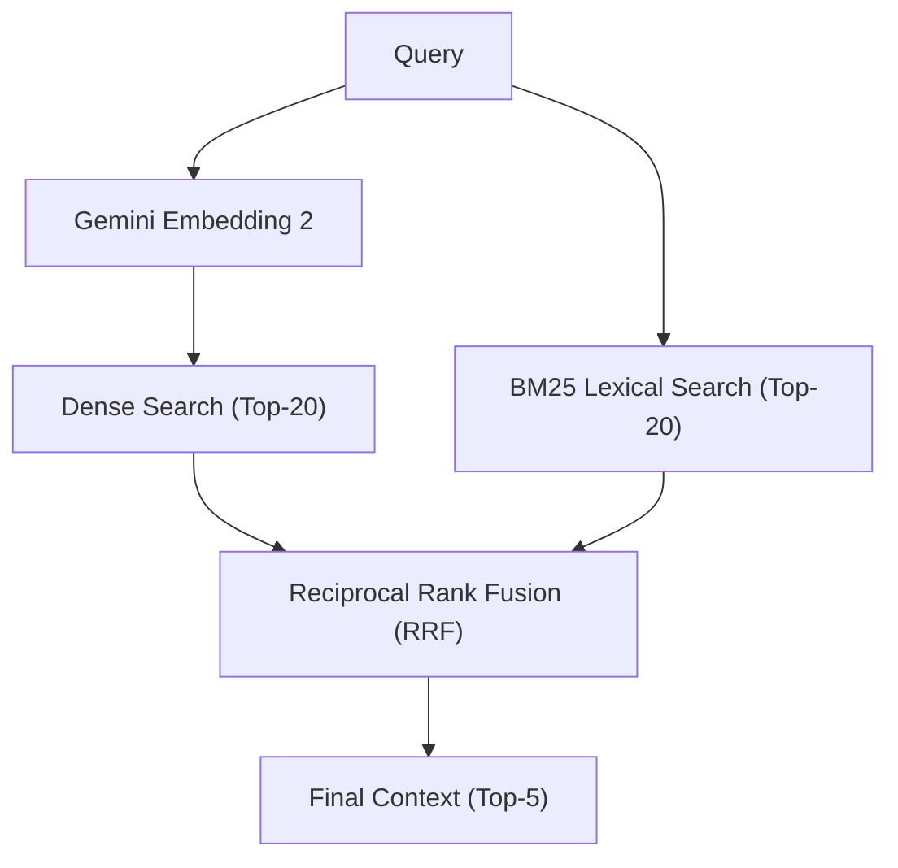
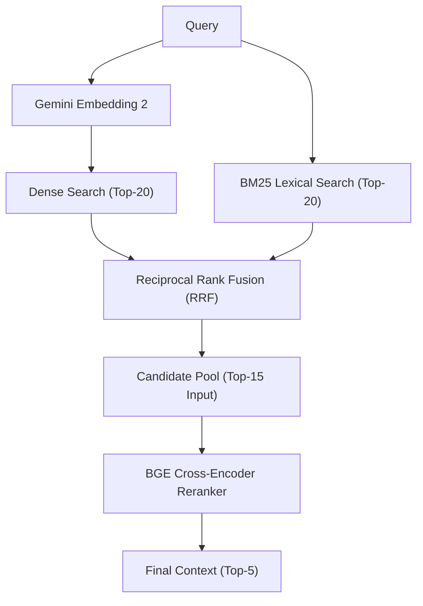
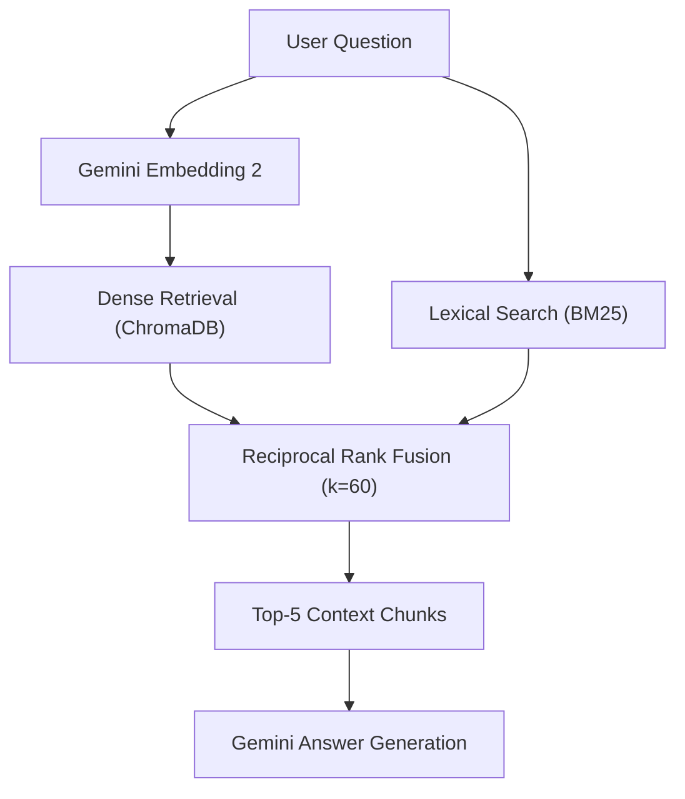

# SmartDocQ Benchmarking Module

This module provides reproducible tools for evaluating the **Information Retrieval (IR) quality and performance** of the SmartDocQ retrieval pipeline.

The benchmark compares:

- **Baseline:** Hybrid Dense Retrieval + BM25 + Reciprocal Rank Fusion (RRF)
- **Reranked:** Hybrid Dense Retrieval + BM25 + RRF + BGE Cross-Encoder Reranking

The evaluation focuses on retrieval quality and query latency before the final Gemini answer-generation stage.

---

## Directory Structure

```text
backend/benchmark/

├── datasets/
│   └── scifact/                  # Local BEIR SciFact dataset (not committed)
│
├── results/
│   └── scifact_metrics.json      # Final aggregate benchmark results
│
├── scripts/
│   └── benchmark_reranker.py     # Main benchmark execution script
│
└── README.md
```

The SciFact dataset and generated intermediate files are excluded from Git.

---

## Dataset

The benchmark uses the BEIR SciFact information retrieval dataset.

SciFact contains scientific abstracts, scientific claims, and relevance judgments used to evaluate retrieval quality.

The final evaluation used:

- **5,183 scientific abstracts**
- **300 evaluation queries**
- **SciFact test-set relevance judgments**

The benchmark automatically downloads and extracts the dataset if it is not available locally.

---

## Evaluated Retrieval Pipelines

### Baseline Pipeline


### Reranked Pipeline


The BGE reranker was evaluated as an experimental retrieval component and was not enabled in the SmartDocQ production pipeline following the benchmark results.

---

## Models

| Component | Model |
| :--- | :--- |
| **Query/document embeddings** | `models/gemini-embedding-2` |
| **Reranker** | `BAAI/bge-reranker-base` |
| **Lexical retrieval** | BM25 |
| **Fusion** | Reciprocal Rank Fusion (RRF) |

---

## Retrieval Configuration

| Parameter | Value |
| :--- | :--- |
| **Dense Top-K** | 20 |
| **BM25 Top-K** | 20 |
| **Maximum candidate pool** | 40 |
| **Average actual candidate pool** | 33.2 |
| **Minimum candidate pool** | 21 |
| **Maximum candidate pool** | 40 |
| **BGE rerank input** | 15 |
| **Final Top-K** | 5 |

---

## Environment Configuration

The benchmark can be configured using environment variables:

| Variable | Default | Description |
| :--- | :---: | :--- |
| `RERANKER_MODEL` | `BAAI/bge-reranker-base` | Reranker model identifier or `mock` to bypass model loading. |
| `BENCHMARK_SAMPLE` | `50` | Number of evaluation queries to sample, or `0` to run on the complete test set. |
| `BENCHMARK_CORPUS_SIZE` | `5183` | Number of abstracts to index. Set to `0` to use the full corpus. |
| `BENCHMARK_OFFLINE` | `false` | Run using mock embeddings without external embedding requests. |
| `BENCHMARK_FORCE_REINDEX` | `false` | Force a clean rebuild of the benchmark index. |

For the final evaluation:

```powershell
$env:BENCHMARK_SAMPLE="300"
$env:BENCHMARK_CORPUS_SIZE="5183"
$env:RERANKER_MODEL="BAAI/bge-reranker-base"
```

---

## How to Run

Run the benchmark from the `backend/` directory with the backend virtual environment activated.

### Offline / Mock Mode

Useful for verifying that the benchmark pipeline executes correctly without making embedding requests:

```powershell
$env:BENCHMARK_OFFLINE="true"
$env:RERANKER_MODEL="mock"
$env:BENCHMARK_SAMPLE="10"

python benchmark/scripts/benchmark_reranker.py
```

### BGE Reranker Evaluation

To evaluate the actual BGE cross-encoder:

```powershell
$env:RERANKER_MODEL="BAAI/bge-reranker-base"

python benchmark/scripts/benchmark_reranker.py
```

For the final evaluation, use:

```powershell
$env:BENCHMARK_SAMPLE="300"
$env:BENCHMARK_CORPUS_SIZE="5183"
$env:RERANKER_MODEL="BAAI/bge-reranker-base"

python benchmark/scripts/benchmark_reranker.py
```

---

## Final Benchmark Results

The final evaluation was performed on the complete 5,183-document SciFact corpus using 300 queries.

### Retrieval Quality

| Metric | Hybrid RRF | RRF + BGE | Change |
| :--- | :---: | :---: | :---: |
| **nDCG@5** | **0.8294** | 0.7337 | **-11.53%** |
| **MRR@5** | **0.8092** | 0.7107 | **-12.18%** |
| **Recall@5** | **0.9146** | 0.8331 | **-8.91%** |
| **Precision@5** | **0.2040** | 0.1833 | **-10.13%** |

The baseline Hybrid RRF pipeline outperformed the BGE-reranked pipeline across all four retrieval-quality metrics.

### Candidate Recall

| Metric | Baseline | RRF + BGE |
| :--- | :---: | :---: |
| **Recall@Candidate Pool** | 0.9867 | 0.9867 |
| **Recall@BGE Input** | 0.9800 | 0.9800 |

This indicates that relevant documents were already present in the candidate set supplied to the reranker.

The results indicate that the observed quality degradation occurred during reranking rather than because relevant documents were absent from the candidate pool.

### Reranker Behavior

Across 300 evaluated queries:

| Statistic | Result |
| :--- | :--- |
| **Queries processed** | 300 |
| **Candidate ordering changed** | 300 / 300 (100%) |
| **Top-5 membership changed** | 276 / 300 (92%) |
| **Top-5 ordering changed** | 294 / 300 (98%) |
| **Top-1 changed** | 99 / 300 (33%) |
| **nDCG improved** | 27 queries |
| **nDCG unchanged** | 185 queries |
| **nDCG degraded** | 88 queries |
| **MRR improved** | 26 queries |
| **MRR unchanged** | 199 queries |
| **MRR degraded** | 75 queries |

### Latency Results

Average latency per query:

| Component | Hybrid RRF | RRF + BGE |
| :--- | :---: | :---: |
| **Dense search** | 103.97 ms | 86.26 ms |
| **BM25** | 41.99 ms | 40.59 ms |
| **RRF** | 2.99 ms | 2.78 ms |
| **BGE Cross-Encoder** | — | **15,243.35 ms** |
| **Pipeline excluding embedding** | **149.09 ms** | **15,373.12 ms** |

The BGE reranker added approximately **15,224 ms/query** of pipeline latency compared with the baseline.

The BGE model was evaluated on CPU in this benchmark.

### Statistical Significance

The degradation in retrieval quality was statistically significant.

For the paired nDCG@5 difference:

- **Paired $t$-test $p$-value**: **$4.75 \times 10^{-8}$**
- **Wilcoxon signed-rank $p$-value**: **$1.73 \times 10^{-7}$**
- **Bootstrap 95% CI for $\Delta\text{nDCG@5}$**: **[-0.1295, -0.0622]**

The confidence interval remains below zero, supporting the observed degradation in nDCG@5.

---

## Engineering Conclusion

For the evaluated SmartDocQ retrieval configuration, **Hybrid Dense + BM25 + RRF is preferred over adding `BAAI/bge-reranker-base`**.

The BGE reranker:
- Decreased nDCG@5 by 11.53%
- Decreased MRR@5 by 12.18%
- Decreased Recall@5 by 8.91%
- Decreased Precision@5 by 10.13%
- Added approximately 15.2 seconds of CPU pipeline latency per query

The BGE candidate input achieved 0.9800 Recall, indicating that relevant documents were available to the reranker for nearly all evaluated queries.

Therefore, BGE reranking was **not enabled** in the SmartDocQ production retrieval pipeline.

The current production retrieval architecture remains:



The reranker implementation remains in the codebase as an experimental/optional component for future evaluation.

---

## Reproducibility

The benchmark stores aggregate results in `benchmark/results/scifact_metrics.json`.

Generated datasets, query embedding caches, per-query results, and Python cache files are excluded from version control.

The benchmark can therefore be reproduced by cloning the repository and running the benchmark script, which will download the required SciFact dataset when necessary.
